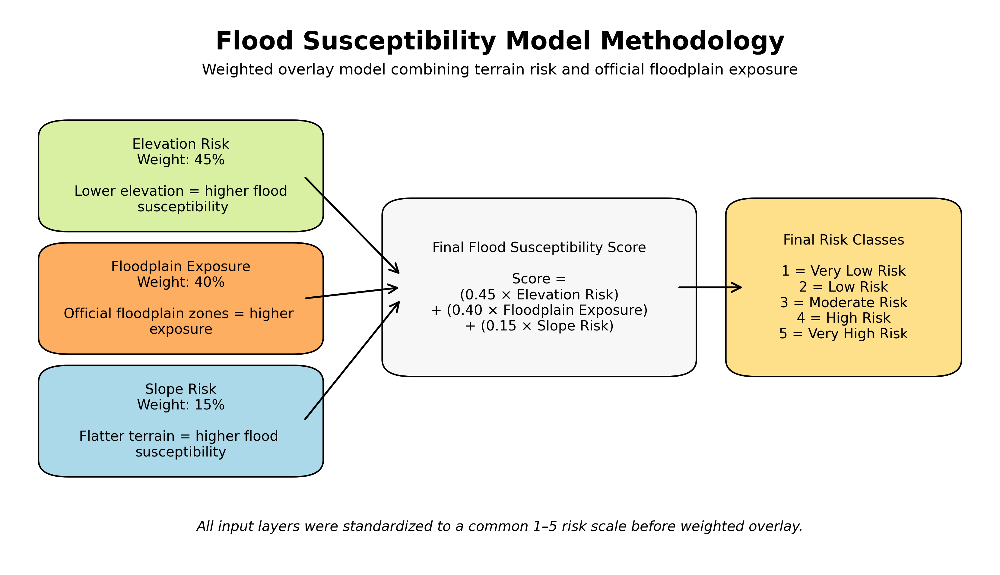
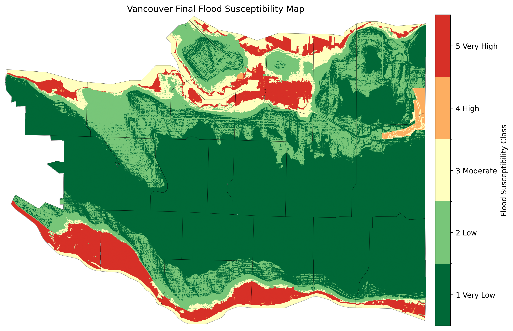
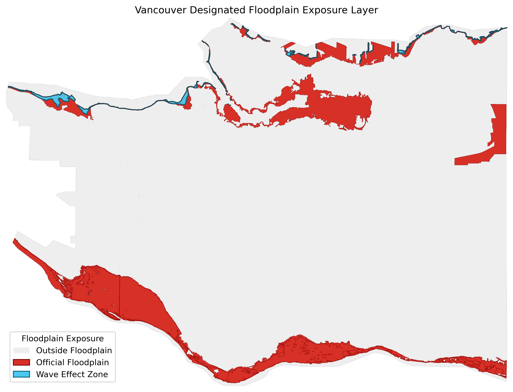
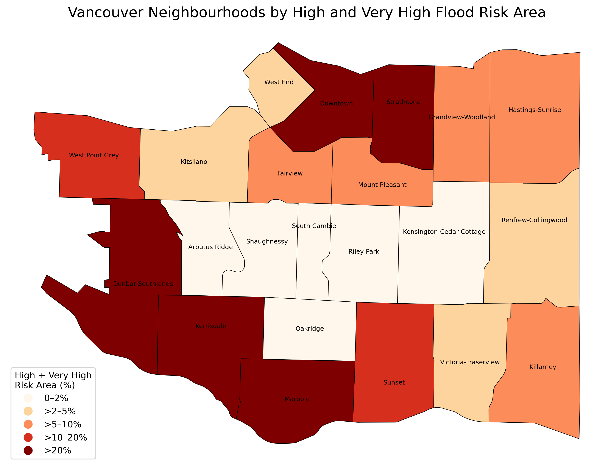
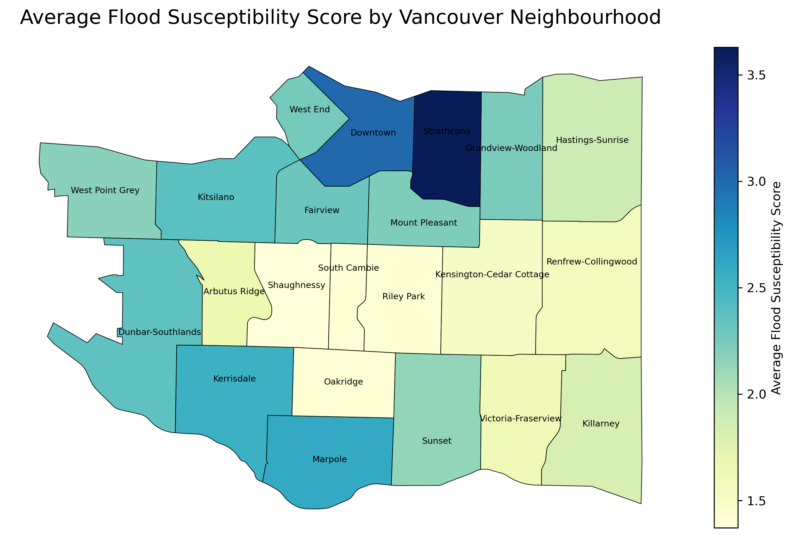
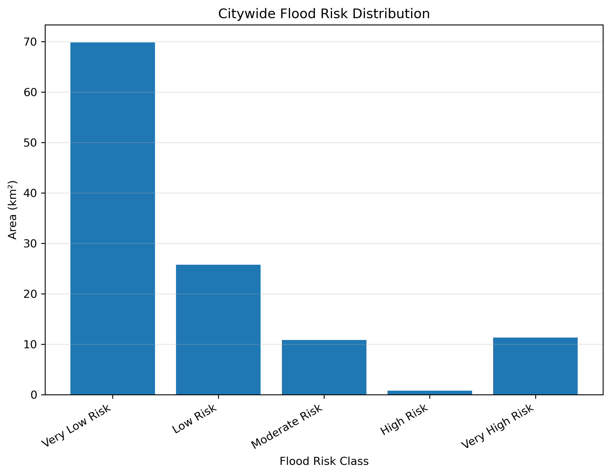
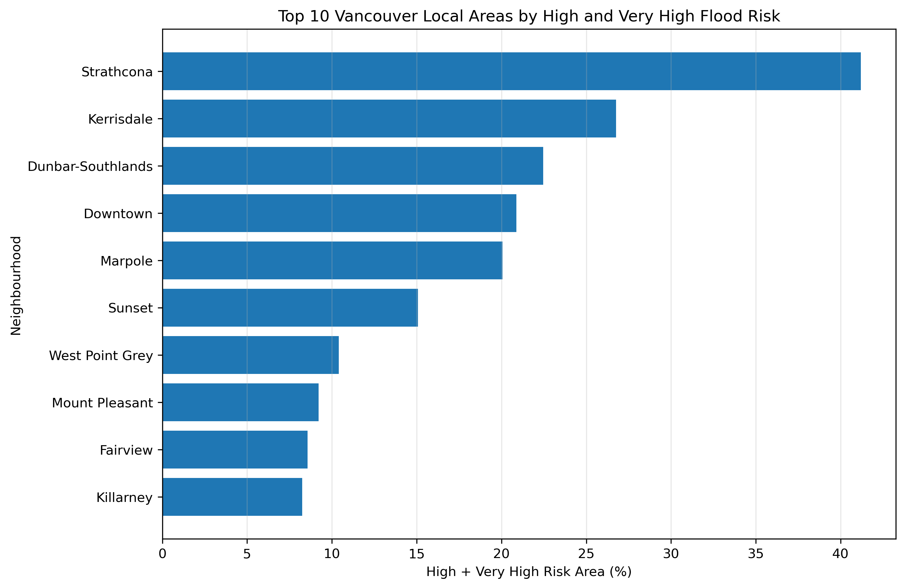
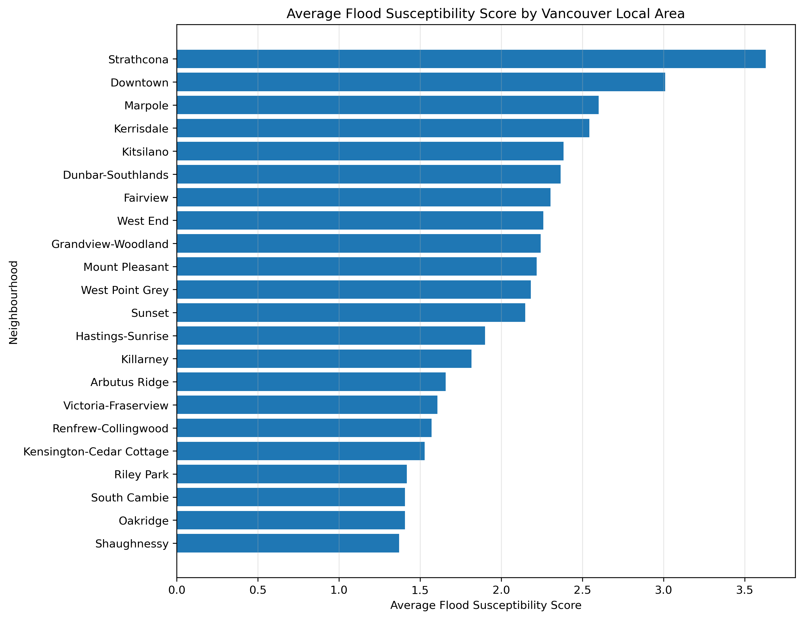

# Vancouver Flood Risk Assessment Using GIS and Python

## Project Overview

This project analyzes flood susceptibility across the City of Vancouver using GIS, raster analysis, and Python. The goal is to create a flood susceptibility model by combining elevation risk, slope risk, and official floodplain exposure into a final weighted flood risk surface.

The project also summarizes flood risk at the neighbourhood level using Vancouver local area boundaries.

---

## Project Objectives

- Process and resample Vancouver DEM data for raster analysis
- Create terrain-based flood risk layers from elevation and slope
- Rasterize official floodplain exposure data
- Build a weighted flood susceptibility model
- Classify Vancouver into five flood risk categories
- Calculate citywide and neighbourhood-level flood risk statistics
- Produce portfolio-ready maps, charts, and methodology visuals

---

## Study Area

The study area is the City of Vancouver, British Columbia, Canada.

Neighbourhood-level results were calculated using Vancouver local area boundaries.

---

## Data Sources

Data used in this project:

- City of Vancouver Digital Elevation Model DEM
- City of Vancouver Local Area Boundary
- City of Vancouver Designated Floodplain

Raw raster data is not included in this repository because of file size. The repository includes scripts, output maps, charts, summary tables, and processed portfolio outputs.

---

## Tools and Libraries

This project was completed using Python.

Main libraries:

```text
numpy
pandas
geopandas
rasterio
matplotlib
shapely
```

---

## Methodology

The flood susceptibility model was created using a weighted overlay approach.

Each input layer was standardized to a common 1 to 5 risk scale:

```text
1 = Very Low Risk
2 = Low Risk
3 = Moderate Risk
4 = High Risk
5 = Very High Risk
```

### Weighted Overlay Formula

```text
Flood Susceptibility Score =
45% Elevation Risk
+ 40% Floodplain Exposure
+ 15% Slope Risk
```

### Model Weights

| Factor | Weight | Reason |
|---|---:|---|
| Elevation Risk | 45% | Lower elevation areas are generally more susceptible to flooding |
| Floodplain Exposure | 40% | Official floodplain zones represent known flood-prone areas |
| Slope Risk | 15% | Flatter terrain may allow water to accumulate more easily |

---

## Model Workflow

The project workflow is divided into seven Python scripts:

```text
00_check_dem.py
01_prepare_data.py
02_dem_processing.py
03_terrain_risk_layers.py
04_floodplain_exposure.py
05_flood_risk_model.py
06_statistics.py
07_neighbourhood_map.py
```

### Workflow Summary

1. Check DEM metadata and create an initial preview
2. Prepare vector layers and convert them to the DEM coordinate system
3. Resample the DEM to 5 m resolution
4. Generate elevation risk and slope risk layers
5. Rasterize official floodplain exposure
6. Combine all risk layers into a final flood susceptibility model
7. Generate neighbourhood-level maps, charts, and methodology figures

---

# Main Outputs

## Flood Susceptibility Methodology

[](figures/flood_susceptibility_methodology.png)

[Open methodology figure](figures/flood_susceptibility_methodology.png)

---

## Final Flood Susceptibility Map

[](maps/flood_susceptibility_class_5m_map.png)

[Open final flood susceptibility map](maps/flood_susceptibility_class_5m_map.png)

---

## Flood Susceptibility Score Map

[](maps/flood_susceptibility_score_5m_map.png)

[Open flood susceptibility score map](maps/flood_susceptibility_score_5m_map.png)

---

## Floodplain Exposure Layer

[](maps/floodplain_exposure_5m_map.png)

[Open floodplain exposure map](maps/floodplain_exposure_5m_map.png)

---

## Neighbourhood-Level Flood Risk Map

[](maps/neighbourhood_high_very_high_risk_pct_map.png)

[Open neighbourhood flood risk map](maps/neighbourhood_high_very_high_risk_pct_map.png)

---

## Average Flood Score by Neighbourhood

[](maps/neighbourhood_average_flood_score_map.png)

[Open average flood score map](maps/neighbourhood_average_flood_score_map.png)

---

## Citywide Flood Risk Distribution

[](figures/citywide_flood_risk_distribution.png)

[Open citywide flood risk distribution chart](figures/citywide_flood_risk_distribution.png)

---

## Top 10 High and Very High Risk Neighbourhoods

[](figures/top_10_high_very_high_risk_neighbourhoods.png)

[Open top 10 neighbourhood chart](figures/top_10_high_very_high_risk_neighbourhoods.png)

---

## Average Flood Score Chart

[](figures/average_flood_score_by_neighbourhood.png)

[Open average flood score chart](figures/average_flood_score_by_neighbourhood.png)

---

# Results

## Citywide Flood Risk Summary

The final flood susceptibility model classified Vancouver into five flood risk categories.

| Risk Class | Risk Label | Area km² | Percentage |
|---:|---|---:|---:|
| 1 | Very Low Risk | 69.82 | 58.93% |
| 2 | Low Risk | 25.74 | 21.73% |
| 3 | Moderate Risk | 10.82 | 9.13% |
| 4 | High Risk | 0.79 | 0.66% |
| 5 | Very High Risk | 11.31 | 9.55% |

Most of Vancouver was classified as Very Low or Low flood susceptibility. Higher risk areas were mainly concentrated along low-lying waterfront areas, official floodplain zones, and parts of eastern and southern Vancouver.

---

## Neighbourhood-Level Results

Neighbourhood-level flood risk was calculated using Vancouver local area boundaries.

The main neighbourhood statistic used was:

```text
Percentage of each neighbourhood classified as High or Very High flood risk
```

Top neighbourhoods identified by High and Very High flood risk percentage include:

```text
Strathcona
Kerrisdale
Dunbar-Southlands
Downtown
Marpole
Sunset
West Point Grey
Mount Pleasant
Fairview
Killarney
```

These results are based on the percentage of each local area that falls within the High and Very High flood susceptibility classes.

---

# Project Structure

```text
Flood_Risk_Accessment/
│
├── data/
│   ├── raw/
│   ├── processed/
│   └── outputs/
│
├── scripts/
│   ├── 00_check_dem.py
│   ├── 01_prepare_data.py
│   ├── 02_dem_processing.py
│   ├── 03_terrain_risk_layers.py
│   ├── 04_floodplain_exposure.py
│   ├── 05_flood_risk_model.py
│   ├── 06_statistics.py
│   └── 07_neighbourhood_map.py
│
├── maps/
│
├── figures/
│
├── README.md
├── requirements.txt
└── .gitignore
```

---

# How to Run the Project

Install the required Python libraries:

```bash
pip install -r requirements.txt
```

Run the scripts in order:

```bash
python scripts/00_check_dem.py
python scripts/01_prepare_data.py
python scripts/02_dem_processing.py
python scripts/03_terrain_risk_layers.py
python scripts/04_floodplain_exposure.py
python scripts/05_flood_risk_model.py
python scripts/06_statistics.py
python scripts/07_neighbourhood_map.py
```

---

# Key Outputs

## Processed Raster Outputs

```text
data/processed/vancouver_dem_5m.tif
data/processed/slope_5m.tif
data/processed/elevation_risk_5m.tif
data/processed/slope_risk_5m.tif
data/processed/floodplain_exposure_5m.tif
data/processed/flood_susceptibility_score_5m.tif
data/processed/flood_susceptibility_class_5m.tif
```

## Tabular Outputs

```text
data/outputs/flood_risk_class_summary.csv
data/outputs/neighbourhood_flood_risk_summary.csv
data/outputs/neighbourhood_risk_class_area.csv
```

## Spatial Summary Output

```text
data/outputs/local_areas_flood_risk_summary.geojson
```

---

# Skills Demonstrated

This project demonstrates:

- Raster processing with Rasterio
- Vector processing with GeoPandas
- DEM resampling and terrain analysis
- Slope calculation using NumPy
- Raster reclassification
- Rasterization of vector floodplain data
- Weighted overlay modelling
- Flood susceptibility classification
- Zonal statistics by neighbourhood
- GIS map production using Matplotlib
- Portfolio-ready spatial analysis workflow

---

# Limitations

This project is a flood susceptibility assessment, not a full hydraulic flood simulation.

The model does not include:

- Stormwater drainage capacity
- Rainfall intensity modelling
- Sea level rise scenarios
- Soil infiltration
- Sewer network capacity
- Real-time flood forecasting

The results should be interpreted as a relative flood susceptibility model based on terrain and official floodplain exposure.

---

# Author

**Muhammad Uzair Khalid**  
Bachelor of Information Technology  
Fairleigh Dickinson University, Vancouver Campus  

Project focus: GIS, Python, spatial analysis, environmental risk mapping, and data-driven geospatial modelling.
